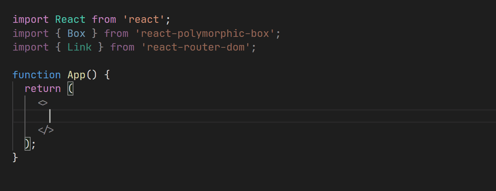

# react-polymorphic-box

Building blocks for strongly typed polymorphic components in React.

[](https://www.npmjs.com/package/react-polymorphic-box)
[](https://lgtm.com/projects/g/kripod/react-polymorphic-box/context:javascript)
[](https://travis-ci.com/kripod/react-polymorphic-box)
[](https://commitizen.github.io/cz-cli/)



## 💡 Motivation

Popularized [by Styled Components v4](https://medium.com/styled-components/announcing-styled-components-v4-better-faster-stronger-3fe1aba1a112), the `as` prop allows changing the HTML tag rendered by a component, e.g.:

```jsx
import { Box } from 'react-polymorphic-box';
import { Link } from 'react-router-dom';

<Box as="a" href="https://github.com/kripod">GitHub</Box>
<Box as={Link} to="/about">About</Box>
```

While this pattern has been encouraged by several libraries, typings had [lacked support for polymorphism](https://blog.andrewbran.ch/polymorphic-react-components/), missing benefits like:

- Automatic code completion, based on the value of the `as` prop
- Static type checking against the associated component's inferred props
- HTML element name validation

## 📚 Usage

A `Heading` component can demonstrate the effectiveness of polymorphism:

```jsx
<Heading color="rebeccapurple">Heading</Heading>
<Heading as="h3">Subheading</Heading>
```

Custom components like the previous one may utilize the package as shown below.

```tsx
import { Box, PolymorphicComponentProps } from "react-polymorphic-box";

// Component-specific props should be specified separately
export interface HeadingOwnProps {
  color?: string;
}

// Merge own props with others inherited from the underlying element type
export type HeadingProps<
  E extends React.ElementType
> = PolymorphicComponentProps<E, HeadingOwnProps>;

// An HTML tag or a different React component can be rendered by default
const defaultElement = "h2";

export function Heading<E extends React.ElementType = typeof defaultElement>({
  color,
  style,
  ...restProps
}: HeadingProps<E>): JSX.Element {
  // The `as` prop may be overridden by the passed props
  return <Box as={defaultElement} style={{ color, ...style }} {...restProps} />;
}
```

### Typing external components

Alternatively, you can also type your custom components by using the `PolymorphicComponent` type. This is especially handy when working with external libraries that already expose polymorphic components. Here's an example implementing the Heading component from above using [styled-components](https://styled-components.com):

```tsx
import { PolymorphicComponent } from "react-polymorphic-box";
import styled from "styled-components";

// Component-specific props
interface HeadingProps {
  color?: string;
}

// An HTML tag or a different React component can be rendered by default
const defaultElement = "h2";

const Heading: PolymorphicComponent<
  HeadingProps, // Merged with props from the underlying element type
  typeof defaultElement // Default element type (optional, defaults to 'div')
> = styled(defaultElement)<HeadingProps>`
  color: ${(props) => props.color};
`;
```

### Forwarding Refs

Library authors should consider encapsulating reusable components, [passing a ref](https://reactjs.org/docs/forwarding-refs.html) through each of them:

```tsx
import { Box } from "react-polymorphic-box";

export const Heading = React.forwardRef(
  <E extends React.ElementType = typeof defaultElement>(
    { color, style, ...restProps }: HeadingProps<E>,
    innerRef: typeof restProps.ref
  ) => {
    return (
      <Box
        as={defaultElement}
        style={{ color, ...style }}
        {...restProps}
        ref={innerRef}
      />
    );
  }
) as <E extends React.ElementType = typeof defaultElement>(
  props: HeadingProps<E>
) => React.ReactElement | null;
```

The component can then receive a `ref` prop _([live demo](https://codesandbox.io/s/react-polymorphic-box-forwarding-refs-2l81h)),_ just like a regular HTML element:

```tsx
import { useRef } from "react";

function App() {
  const ref = useRef<HTMLHeadingElement>(null);
  return <Heading ref={ref}>It works!</Heading>;
}
```
